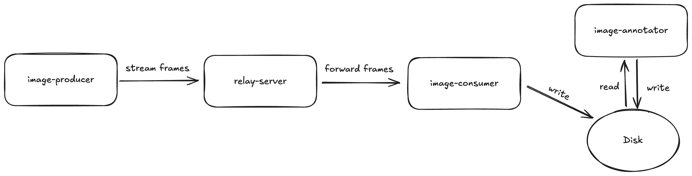
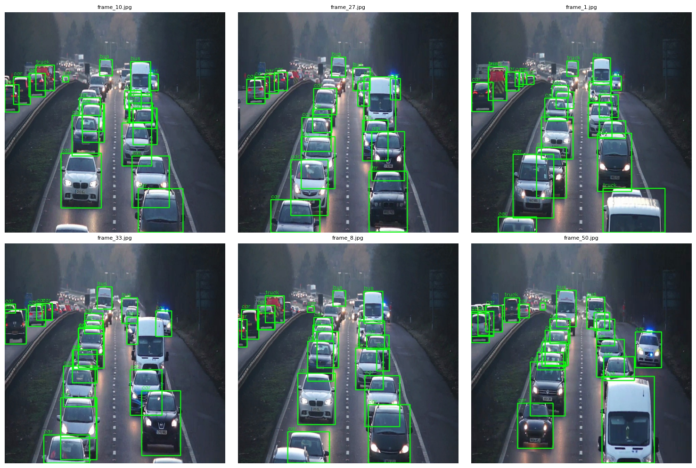

# Video Ingestion System

A distributed system for real-time video ingestion and annotation using Apache Spark.

## System Architecture



### Components

* **Image Producer**: Streams video frames to the relay server.
* **Relay Server**: RTSP relay server.
* **Image Consumer**: Captures frames from the relay server and saves them to disk.
* **Image Annotator**: Uses Spark structured streaming with PyTorch (YOLOv8) to annotate saved frames (e.g., vehicle detection).

## Prerequisites

Install:

* [Docker](https://docs.docker.com/get-docker/)
* [Docker Compose](https://docs.docker.com/compose/install/)

## Getting Started


1. **Build and start the services** with Docker Compose:

   ```bash
   docker-compose up
   ```

   This command builds Docker images (if needed) and runs the containers.

2. **View service logs**:

   ```bash
   docker-compose logs -f
   ```

   For logs of a specific service:

   ```bash
   docker-compose logs -f <service_name>
   ```

3. **Stop the services**:

   ```bash
   docker-compose down
   ```

4. **Check output images**:

   All raw and annotated frames are saved under the `./data` directory on your host machine.

   * Original frames are saved here:

     ```
     ./data/YYYY_MM_DD/frame_XXXX.jpg
     ```

   * Annotated frames are saved here:

     ```
     ./data/YYYY_MM_DD/annotated/frame_XXXX.jpg
     ```
---

## Results

> The following section shows a sample of annotated frames generated by the system.

